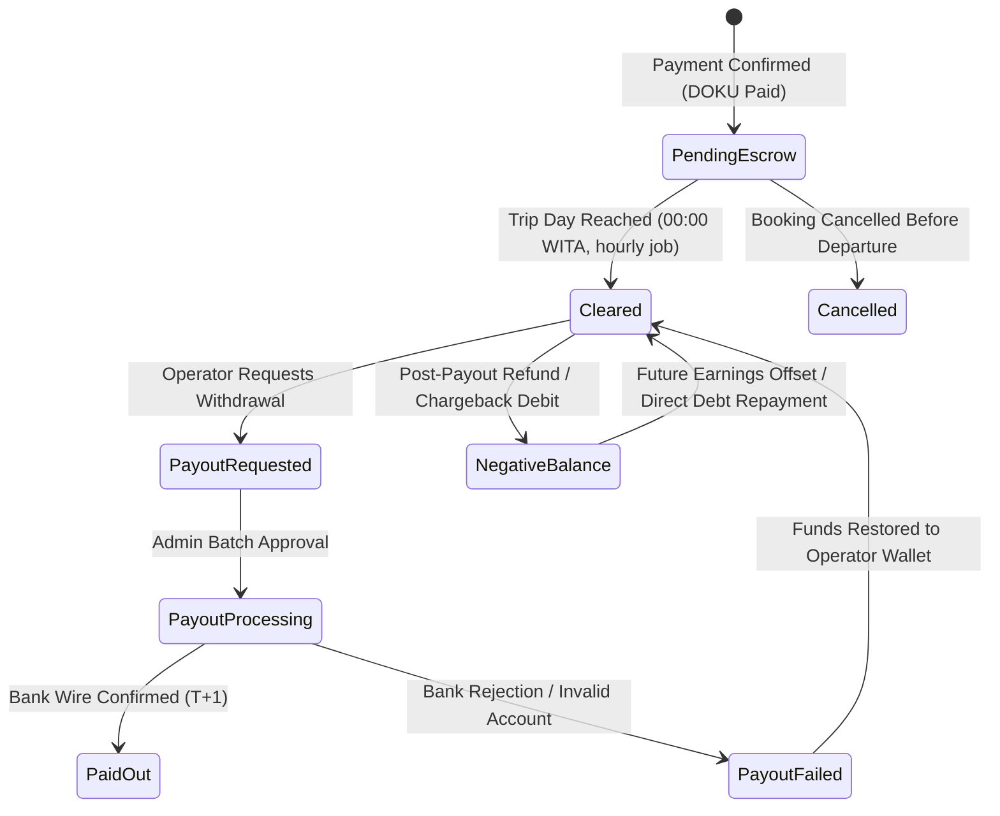

# EMVI Booking Engine Platform — Canonical V1 Money Rules & Settlement Specification (Rev. 17)

_Last reviewed: 2026-10-03_

> **Authoritative source of truth** for engineering, finance, platform operations, merchant legal terms and support accounting. Prices and plan limits live in [plans-and-pricing.md](plans-and-pricing.md).

## 0. Implementation status (read first)

This spec describes the target rules. The table shows what the code does today, so finance and support do not promise what is not automated yet.

| Rule | Status in code |
| :--- | :--- |
| 100% of listed price to operator; 5% guest fee capped at Rp 250.000 | **Done.** `BookingPricingService`, `WalletService::creditBookingPayment()` |
| Amounts are whole rupiah (fee, discount, total), as DOKU takes no cents | **Done.** `BookingPricingService`, `PlatformSetting::calculateGuestServiceFee()` |
| Guest coupon use is counted when the booking is paid, not when the hold is made | **Done.** `ReservationLifecycleService::applyPaidPayment()` |
| A second payment on an already paid booking is refunded, never credited twice | **Done.** `ReservationLifecycleService::canStillHonour()` |
| A payment after the hold ran out is honoured only while the seats are still free; otherwise refunded | **Done.** Same check, with a locked capacity read |
| DOKU payment page closes when the seat hold ends | **Done.** `dueMinutes` = time left on the hold |
| Payment page cannot be opened: hold released at once, nothing charged | **Done.** `ReservationBookingService::createHold()` |
| Only approved shops take payments (not pending, suspended or demo) | **Done.** `Operator::assertCheckoutAllowed()` |
| Escrow until trip day, then cleared | **Done.** `wallet:release-escrows`, hourly; clears from 00:00 WITA on the trip day |
| Payouts: minimum Rp 50.000; Rp 2.500 fee under Rp 500.000; auto BI-FAST up to Rp 10.000.000, larger amounts wait for an admin | **Done.** `WalletService` (`createPayoutRequest`, `disbursePayout`, approve or reject) |
| Payout claim is atomic (no double send) and a failed bank transfer returns to pending | **Done** |
| Cancel before trip day voids escrow; cancel after it is cleared debits the balance once | **Done.** `WalletService::cancelBookingEarning()` |
| Card dispute: hold amount + Rp 150.000; won releases; lost settles | **Done.** `openCardDispute`, `releaseDispute`, `settleLostDispute` (admin desk) |
| Admin manual adjustment with reason (audit-logged) | **Done.** `recordManualAdjustment` |
| Negative balance blocks payouts until the balance recovers | **Done**, through the payout minimum check |
| Daily check for paid guest payments with no operator earning | **Done.** `platform:match-payments` at 03:00 WITA. This is not a DOKU settlement-file reconciliation yet |
| Partial refunds | **Method only** (`processPartialRefund`). No desk action yet |
| Operator-fault cancellation debits the operator for the guest fee and gateway fee | **Policy only.** Today only the earning is reversed |
| Gateway fee absorption accounting, 30-day demand notices, debt write-off (`WriteOffLoss`), DOKU settlement-file reconciliation | **Policy only.** Not automated |

---

## 1. Canonical Financial Terminology & Definitions

Every monetary calculation, API payload, invoice, and ledger transaction across EMVI Platform MUST adhere strictly to the following 15 canonical definitions:

1. **Booking Listed Price ($P_{list}$)**: The net tour package or product price specified by the operator (e.g., `Rp 1.000.000`).
2. **Guest Service Fee ($F_{guest}$)**: The standard platform fee (e.g., 5.0% = `Rp 50.000`, capped) added to the guest's checkout cart on **every** plan, including Agency. Subscription does not waive this fee. EMVI remains merchant of record and pays DOKU from this margin.
3. **Guest Total Paid ($T_{guest}$)**: Total amount collected from guest at checkout:
   $$T_{guest} = P_{list} + F_{guest}$$
4. **Gateway Processing Fee ($F_{gw}$)**: Non-refundable fee charged by DOKU or card acquirers (e.g., 0.7% for QRIS = `Rp 7.350` on `Rp 1.050.000`).
5. **Operator Gross Entitlement ($E_{op}$)**: 100% of the listed price ($P_{list}$) deposited into operator escrow ($E_{op} = P_{list}$).
6. **EMVI Platform Revenue ($R_{emvi}$)**: Platform service fee collected ($R_{emvi} = F_{guest}$).
7. **EMVI Net Contribution Margin ($M_{net}$)**: Net platform profit after covering gateway payment costs:
   $$M_{net} = F_{guest} - F_{gw}$$
8. **Pending Escrow ($B_{escrow}$)**: Funds held safely until the trip departure date (`requested_date`).
9. **Cleared Balance ($B_{cleared}$)**: Matured escrow funds available for payout withdrawal.
10. **Paid-Out Amount ($W_{paid}$)**: Cumulative total disbursed to the operator's verified bank account.
11. **Refund Deduction ($D_{refund}$)**: Ledger debit issued when a booking is partially or fully refunded.
12. **Chargeback Deduction ($D_{cb}$)**: Ledger debit for credit card fraud disputes plus DOKU dispute administrative fee ($F_{dispute} = \text{Rp 150.000}$).
13. **Manual Adjustment ($A_{manual}$)**: Admin finance ledger entries for dispute resolutions, fee corrections, or promotional credits.
14. **Negative Balance ($B_{neg}$)**: Condition where $B_{cleared} < 0$ following post-payout refunds or chargebacks.
15. **Recoverable Operator Debt ($D_{rec}$)**: Uncollected negative balance actively tracked for collection or offset against future earnings.

---

## 2. Canonical Transaction Lifecycles & Double-Entry Ledger Entries

All financial entries in `WalletTransaction` are **append-only and immutable**. Historical ledger records are NEVER deleted or overwritten.

```text
===================================================================================
 1. SUCCESSFUL BOOKING LIFECYCLE:
-----------------------------------------------------------------------------------
 Guest Checkout (DOKU QRIS Rp 1.050.000):
   [CREDIT]  Operator Escrow (PendingEscrow):     + Rp 1.000.000 (BookingEarning)
   [CREDIT]  EMVI Platform Revenue:               + Rp    50.000 (PlatformCommission)
   [DEBIT]   DOKU Gateway Processing Cost:        - Rp     7.350 (Internal Expense)
 
 Trip Day Reached (from 00:00 WITA, hourly release job):
   [TRANSITION] PendingEscrow ➔ Cleared Balance:   Rp 1.000.000 (Available Balance)

 Operator Payout Request (Rp 1.000.000):
   [DEBIT]   Operator Cleared Balance:            - Rp 1.000.000 (PayoutWithdrawal)
   [TRANSFER] EMVI Bank Account ➔ Operator BCA:     Rp 1.000.000 (Payout Completed)
===================================================================================
```

---

## 3. Explicit 8-State Settlement State Machine

A wallet transaction or payout request MUST exist in exactly one of the following 8 standardized states:



> In code, wallet entries use `pending_escrow`, `cleared` and `cancelled` (`WalletTransactionStatus`), and payouts use `pending`, `processing`, `completed` and `rejected` (`PayoutStatus`). `PayoutRequested` ≈ payout `pending`, `PaidOut` ≈ `completed`, `PayoutFailed` ≈ `rejected` (funds returned), and `Reversed` ≈ `cancelled`. `NegativeBalance` is a condition of the cleared balance, not a stored state.

### State Definitions & Rules
1. `PendingEscrow`: Funds held until trip departure (`requested_date`). Cannot be withdrawn.
2. `Cleared`: Matured funds available for withdrawal ($B_{cleared} \ge \text{Rp 50.000}$).
3. `PayoutRequested`: Withdrawal requested by operator; locked from further spending.
4. `PayoutProcessing`: Admin approved payout; batch file queued for bank transfer.
5. `PaidOut`: Bank transfer confirmed via wire reference number; final state.
6. `PayoutFailed`: Bank transfer rejected (invalid account/name mismatch); funds restored to `Cleared`.
7. `Reversed`: Escrow transaction voided due to pre-departure cancellation.
8. `NegativeBalance`: Cleared balance $< 0$. Payouts locked; 100% incoming earnings auto-diverted.

---

## 4. Formalized Risk Policies & Ugly Edge Cases (P0 Rules)

### Policy 1: Post-Payout Refund & Negative Balance Recovery
- **Trigger**: A guest refund or chargeback is granted after the operator has already withdrawn funds ($B_{cleared} = 0$).
- **Mechanism**: System writes a `RefundDeduction` debit for the net amount, pushing the operator balance negative ($B_{cleared} = -P_{list}$).
- **Auto-Recovery**: 100% of all future booking earnings are automatically diverted to offset the negative balance until $B_{cleared} \ge 0$.
- **Payout Lockout**: Payout requests remain locked until $B_{cleared} \ge \text{Rp 50.000}$.
- **Storefront Operation**: Operators may continue accepting bookings while indebted; storefront remains active unless flagged for fraud risk.

### Policy 2: Operator Insolvency & Uncollectible Debt
- **30-Day Auto-Demand Notice**: If $B_{cleared} < 0$ for > 30 consecutive days without new booking activity, an automated Demand Notice is issued via email/WhatsApp, and the operator's stored card/bank method is charged.
- **Guest Protection Guarantee**: EMVI Platform immediately refunds the guest from EMVI Loss Reserve so consumer trust is never compromised.
- **Account Suspension & Legal Recovery**: Unresolved debt after 45 days triggers operator portal suspension (`status = suspended`). Debt is transferred to EMVI Collections under the Platform Merchant Agreement.
- **Accounting Treatment**: Write-off is executed as a separate controlled financial event (`WriteOffLoss`), distinguishing `Uncollected Negative Balance` from `Formal Debt Write-Off`.

### Policy 3: Chargeback & Dispute Lifecycle
- **Dispute Received**: DOKU `DISPUTE_OPENED` alert immediately creates a `DisputeHold` transaction for the dispute amount + non-refundable DOKU Chargeback Fee ($F_{dispute} = \text{Rp 150.000}$).
- **Dispute Resolution Outcomes**:
  - **Won**: `DisputeHold` is released back to operator's `Cleared` balance.
  - **Lost**: Dispute amount + $F_{dispute}$ fee are permanently debited via `RefundDeduction`.

### Policy 4: Gateway Processing Fee & Refund Accounting Matrix

| Refund Scenario | Guest Impact | Service Fee ($F_{guest}$) | Gateway Fee ($F_{gw}$) | Operator Impact |
| :--- | :--- | :--- | :--- | :--- |
| **Guest Cancellation (In Policy)** | 100% Refund ($T_{guest}$) | Refunded to Guest | Absorbed by EMVI Margin | 0 Escrow Earned |
| **Guest Cancellation (Late / No Show)** | 0% Refund | Retained by EMVI | Covered by Guest Payment | 100% Net Payout Retained |
| **Operator Cancellation** | 100% Refund ($T_{guest}$) | Refunded to Guest | Debited from Operator | Wallet Debited for Refund + $F_{guest}$ + $F_{gw}$ |
| **Partial Refund (Guest Request)** | Proportional Refund | Proportional Refund | Absorbed by EMVI Margin | Proportional `RefundDeduction` |
| **Chargeback Fraud (Lost)** | Refunded by Issuing Bank | Refunded by Bank | Debited from Operator | Wallet Debited for Booking + $F_{dispute}$ |

### Policy 5: Payout Failure Handling & Retry Protocol
- **Validation**: Bank Provider, Account Number, and Account Name must be verified before withdrawal request submission.
- **Failure Reversal**: If payout fails at the bank level (e.g. account closed/name mismatch), system executes `rejectPayout()`, returning 100% of funds to `Cleared` status with an automated alert to operator.

### Policy 6: Daily DOKU Settlement Reconciliation Engine
- **Today**: `php artisan platform:match-payments` (daily at 03:00 WITA) flags paid guest payments that never reached an operator wallet. Settlement-file matching below is the target.
- **Matching Criteria**: Cross-checks DOKU bank settlement report against `Payment` `gateway_ref` invoice numbers, verifying transaction amounts, gateway fees, and net settlement values.
- **Exception Queue**: Unmatched or delayed records are queued in `/admin/platform` Exception Queue for manual finance review.

---

## 5. Plans

Plan prices, limits and features live only in [plans-and-pricing.md](plans-and-pricing.md). Every plan uses the EMVI DOKU wallet with the same 5% guest fee and 0% operator commission.

---

## 6. Plan Upgrade, Subscription Proration & Operational Money Rules

1. **Immediate Upgrade with Linear Proration**: Upgrading from *Growth* to *Agency* takes effect immediately. The exact linear prorated value of unused days on the current cycle is credited towards the new tier invoice.
2. **3-Day Grace Period & Day 4 Fallback Engine**:
   - `Day 1 - 3`: Retry payment attempt & display warning banner in Operator Portal. Storefront remains fully operational.
   - `Day 4`: If payment remains uncollected, account automatically falls back to *Starter (Free)* (`subscriptions:return-unpaid-to-free`). Custom domains pause to `slug.travelengine.id` and live listings over the Starter limit go to *Draft*. The guest fee is 5% on every plan, so it does not change.
3. **IDR Currency Standardization**: All transactions, checkouts, escrows, and payouts operate strictly in **Indonesian Rupiah (IDR)** for zero FX risk and 100% net operator price guarantee.
4. **Payout Transfer Fee Policy**: Manual payout disbursements $\ge \text{Rp 500.000}$ are **100% Free** (absorbed by platform margin); payouts $< \text{Rp 500.000}$ incur a flat **Rp 2.500** BI-FAST transfer fee. Minimum payout threshold is **Rp 50.000**.
5. **Promo Code Cost Absorption Rules**:
   - **Platform Promo Codes** (Admin-created): subscription invoices only; never applied to guest checkouts.
   - **Operator Promo Codes** (Operator-created): Absorbed by operator earnings; net payout reflects discounted price. The guest fee is still calculated on the full subtotal.

---

## 7. Verification

- Money paths are covered by Pest feature tests (`tests/Feature/Wallet`, `tests/Feature/Security/MoneyHardeningTest.php`, `tests/Feature/Services/SharedBusinessServicesTest.php`) and run on SQLite and MariaDB.
- Every scheduled money job runs with `withoutOverlapping()->onOneServer()` on Bali time (WITA).
